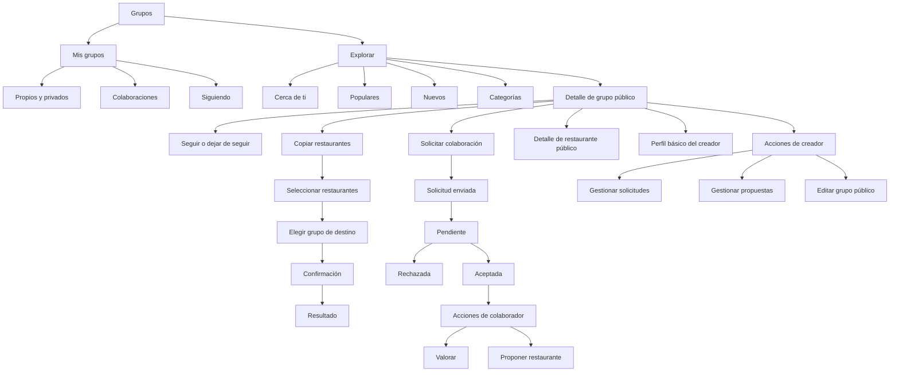

# Mesa · Grupos públicos — Mapa de pantallas y flujos UX

## 1. Principio de navegación

La parte pública se integra dentro de **Grupos**. No se añade una sexta pestaña a la navegación inferior.

La cabecera de Grupos incorpora un selector:

```text
Mis grupos | Explorar
```

### Mis grupos

Incluye:

- Grupos privados propios.
- Grupos públicos creados por la persona.
- Grupos donde colabora.
- Grupos públicos que sigue.

### Explorar

Incluye descubrimiento por zona, categoría, popularidad y novedad.

---

## 2. Arquitectura de información



---

## 3. Pantalla Grupos

### Estructura

1. Título `Grupos`.
2. Botón crear grupo.
3. Selector `Mis grupos | Explorar`.
4. Contenido según pestaña.

### Mis grupos

Orden recomendado:

1. **Tus grupos**.
2. **Colaboras en**.
3. **Siguiendo**.

No se mezclan todos en una lista indiferenciada, porque la relación y los permisos son distintos.

### Tarjeta de grupo propio

Muestra:

- Imagen.
- Nombre.
- Ciudad.
- Privado o público.
- Número de restaurantes.
- Número de miembros o colaboradores.
- Indicador `Creado por ti`.

### Tarjeta de colaboración

Muestra:

- Imagen.
- Nombre.
- Creador.
- Ciudad.
- Indicador `Colaborador`.
- Número de restaurantes.

### Tarjeta de grupo seguido

Muestra:

- Imagen.
- Nombre.
- Creador.
- Ciudad.
- Número de restaurantes.
- Número de seguidores.
- Indicador `Siguiendo`.

---

## 4. Pantalla Explorar

## Objetivo

Permitir que una persona encuentre grupos útiles en pocos segundos sin necesitar conocer a sus autores.

### Cabecera

```text
Explorar
Descubre listas creadas por gente de tu zona
```

### Control de ubicación

Píldora superior:

```text
Girona · Cambiar
```

Al pulsar:

- Usar mi ubicación.
- Elegir ciudad.
- Ciudades recientes.

### Buscador

Placeholder:

```text
Buscar grupos, cocinas o zonas...
```

Busca por:

- Nombre del grupo.
- Nombre del creador.
- Categoría.
- Etiquetas.
- Ciudad.
- Restaurantes incluidos.

### Chips de filtro

- Distancia.
- Categoría.
- Más populares.
- Nuevos.

La selección abre paneles, igual que los filtros del mapa actual, manteniendo el lenguaje visual de Mesa.

### Bloques

#### Cerca de ti

Carrusel horizontal con grupos relevantes por zona.

#### Populares en Girona

Lista vertical de tarjetas más completas.

#### Nuevos esta semana

Carrusel para dar exposición a listas recientes.

#### Explora por categoría

Píldoras o tarjetas:

- Hamburguesas.
- Brunch.
- Japonés.
- Para una cita.
- Menú del día.
- Joyas escondidas.

### Estado sin ubicación

```text
Elige una ciudad para descubrir grupos cerca de ti
```

Botón:

```text
Elegir ciudad
```

### Estado sin resultados locales

```text
Todavía no hay grupos públicos en esta zona
```

Acciones:

- Ampliar distancia.
- Explorar Girona.
- Crear el primer grupo público de la zona.

---

## 5. Tarjeta de grupo público

### Jerarquía visual

1. Imagen del grupo.
2. Categoría o etiqueta principal.
3. Nombre.
4. `por @username`.
5. Metadatos.
6. Acción seguir.

Ejemplo:

```text
HAMBURGUESAS
Las mejores hamburguesas de Girona
por @eustaquio
18 restaurantes · 246 seguidores · A 1,8 km
```

### Acción seguir

Se representa como bookmark o botón compacto:

```text
Seguir
```

Estado activo:

```text
Siguiendo
```

No abre diálogo. La acción es inmediata y reversible.

### Indicadores opcionales

- `Nuevo`.
- `Popular`.
- `Acepta colaboradores`.
- `Actualizado esta semana`.

No mostrar más de dos indicadores a la vez para evitar ruido.

---

## 6. Detalle de grupo público

El detalle conserva la estética de los grupos actuales, pero cambia acciones y contexto según el rol.

### Cabecera visual

- Imagen grande.
- Categoría.
- Nombre.
- Creador con avatar y `@username`.
- Ciudad o zona.
- Seguidores.
- Restaurantes.
- Última actualización.

### Acciones según rol

#### Visitante

Acción principal:

```text
Seguir
```

Acciones secundarias:

```text
Solicitar colaborar
Copiar restaurantes
```

#### Seguidor

Acción principal:

```text
Siguiendo
```

Acciones secundarias:

```text
Solicitar colaborar
Copiar restaurantes
```

#### Solicitud pendiente

```text
Solicitud pendiente
```

Acciones:

```text
Cancelar solicitud
Copiar restaurantes
```

#### Colaborador

Acción principal:

```text
Proponer restaurante
```

Acciones secundarias:

```text
Copiar restaurantes
Ver mis propuestas
```

Puede valorar desde cada detalle de restaurante.

#### Creador

Acción principal:

```text
Añadir restaurante
```

Acciones secundarias:

```text
Editar grupo
Gestionar solicitudes
Gestionar propuestas
```

### Secciones

1. Descripción del creador.
2. Restaurantes.
3. Colaboradores.
4. Actividad reciente ligera.

### Lista de restaurantes

Cada fila muestra:

- Imagen o ilustración.
- Nombre.
- Categoría.
- Nota editorial resumida.
- Valoración media.
- Número de valoraciones.
- Estado editorial.

No se muestra el botón de editar a visitantes, seguidores ni colaboradores.

---

## 7. Detalle de restaurante público

### Cabecera

- Imagen o ilustración.
- Nombre.
- Categoría.
- Dirección.
- Estado dentro de la lista.

### Nota editorial

Bloque destacado:

```text
La recomendación de @eustaquio
```

Debajo aparece la nota editorial.

### Valoraciones

Visible para todos:

- Media.
- Número de valoraciones.
- Lista de valoraciones de colaboradores.

Solo colaborador o creador ve:

```text
Añadir mi valoración
```

### Acciones

Visitante o seguidor:

```text
Copiar a mi grupo
```

Colaborador:

```text
Valorar
Copiar a mi grupo
```

Creador:

```text
Editar nota
Cambiar estado
Retirar del grupo
```

---

## 8. Solicitar colaboración

Se recomienda utilizar una hoja inferior arrastrable, coherente con los filtros del mapa.

### Contenido

```text
Solicitar colaborar

Podrás valorar restaurantes y proponer nuevos sitios.
El creador seguirá decidiendo qué se publica.
```

Campo opcional:

```text
Cuéntale por qué te gustaría colaborar
```

Contador:

```text
0 / 300
```

Botón:

```text
Enviar solicitud
```

### Confirmación

```text
Solicitud enviada
Te avisaremos cuando @eustaquio responda.
```

### Estado pendiente en el grupo

El botón cambia a:

```text
Solicitud pendiente
```

No se puede crear otra solicitud simultánea.

---

## 9. Gestionar solicitudes

Solo creador.

### Acceso

Desde el detalle del grupo mediante un botón con contador:

```text
Solicitudes · 3
```

### Tarjeta de solicitud

- Avatar.
- Nombre.
- `@username`.
- Mensaje opcional.
- Fecha.
- Número de grupos públicos o aportaciones básicas, si existe.

Acciones:

```text
Aceptar
Rechazar
```

### Al aceptar

```text
@pauluna ahora colabora en el grupo
```

### Al rechazar

No se obliga al creador a escribir motivo en el MVP.

---

## 10. Proponer restaurante

Solo colaborador y creador.

### Entrada

Botón:

```text
Proponer restaurante
```

### Flujo

1. Buscar restaurante.
2. Seleccionar resultado o añadir manualmente.
3. Añadir motivo opcional.
4. Enviar propuesta.

### Mensaje de contexto

```text
La propuesta se enviará a @eustaquio antes de publicarse.
```

### Estado de la propuesta

En `Mis propuestas`:

- Pendiente.
- Aprobada.
- Rechazada.

Mientras está pendiente:

- Editar.
- Cancelar.

---

## 11. Gestionar propuestas

Solo creador.

### Tarjeta

- Restaurante.
- Categoría y ubicación.
- Colaborador que propone.
- Motivo.
- Fecha.

Acciones:

```text
Aprobar
Rechazar
```

### Antes de aprobar

El creador puede completar:

- Estado inicial.
- Nota editorial.
- Categoría si falta.

Botón final:

```text
Publicar en el grupo
```

---

## 12. Copiar restaurantes

## Paso 1 · Seleccionar

Pantalla completa o modal amplio.

Cabecera:

```text
Copiar restaurantes
Selecciona los sitios que quieres guardar
```

Elementos:

- Checkbox por restaurante.
- Seleccionar todos.
- Contador seleccionado.

Barra fija inferior:

```text
Continuar con 4
```

## Paso 2 · Elegir destino

Se muestran únicamente destinos válidos:

- Grupos privados donde puede añadir.
- Grupos públicos propios.

Cada tarjeta muestra si algún restaurante ya existe:

```text
2 de estos restaurantes ya están aquí
```

## Paso 3 · Confirmar

Resumen:

```text
Copiar 4 restaurantes a Amigos foodie
```

Información:

```text
Se añadirán como Pendientes de ir.
Las notas y valoraciones originales no se copiarán.
```

Botón:

```text
Copiar restaurantes
```

## Resultado

Éxito completo:

```text
4 restaurantes añadidos a Amigos foodie
```

Éxito parcial:

```text
3 restaurantes añadidos
1 ya estaba en tu grupo
```

Acciones:

```text
Ver mi grupo
Seguir explorando
```

---

## 13. Editar grupo público

Solo creador.

La edición actual de grupos se amplía con:

- Visibilidad pública o privada.
- Ciudad o zona.
- Categoría principal.
- Hasta tres etiquetas.
- Aceptar solicitudes de colaboración.

### Confirmación al publicar

```text
Tu grupo será visible para otras personas

Podrán ver sus restaurantes, notas y valoraciones.
```

Checkbox de confirmación o botón explícito:

```text
Publicar grupo
```

### Confirmación al hacerlo privado

```text
El grupo dejará de aparecer en Explorar
Los seguidores perderán el acceso.
```

---

## 14. Perfil básico del creador

Para el MVP no hace falta una red social completa, pero sí una capa mínima de confianza.

Al pulsar el autor se abre una vista de solo lectura con:

- Avatar.
- Nombre.
- `@username`.
- Bio corta, si existe.
- Número de grupos públicos.
- Grupos públicos del creador.

No se muestran:

- Email.
- Ubicación actual.
- Grupos privados.
- Lista de amigos.

---

## 15. Estados vacíos, carga y errores

### Sin grupos seguidos

```text
Todavía no sigues ningún grupo
Explora listas públicas y guarda las que te inspiren.
```

Botón:

```text
Explorar grupos
```

### Sin colaboradores

```text
Este grupo todavía no tiene colaboradores
```

Para creador:

```text
Comparte el grupo o activa las solicitudes.
```

### Sin restaurantes

El grupo no debería posicionarse como popular hasta tener al menos tres restaurantes, pero puede abrirse por enlace interno.

```text
La lista está empezando
Vuelve pronto para descubrir sus primeros restaurantes.
```

### Error de ubicación

```text
No hemos podido obtener tu ubicación
Puedes elegir una ciudad manualmente.
```

### Error al seguir

Se revierte visualmente el estado y se muestra mensaje no intrusivo.

### Error parcial al copiar

Nunca se deshacen los restaurantes copiados correctamente. Se informa del resultado por elemento.

---

## 16. Consistencia visual con Mesa

### Base

- Fondo crema actual.
- Superficies blancas.
- Terracota como acción principal.
- Verde suave para señales positivas.
- Bordes cálidos y redondeados.
- Sombras muy discretas.

### Componentes reutilizables

- Tarjeta de grupo.
- Tarjeta de restaurante.
- Badge de rol.
- Badge de estado.
- Botón seguir.
- Selector segmentado.
- Panel inferior arrastrable.
- Fila de usuario.
- Estado vacío.

### Jerarquía

- Una acción principal por pantalla.
- Acciones secundarias en botones suaves o menú.
- No usar más de tres badges visibles en una tarjeta.
- Los contadores sociales nunca deben competir con el nombre del grupo.

---

## 17. Accesibilidad y comportamiento

- Áreas pulsables mínimas de 44 × 44.
- Texto no dependiente exclusivamente del color.
- Estado `Siguiendo` visible mediante texto e icono.
- Estados de solicitud expresados con texto.
- Lectura correcta con VoiceOver y TalkBack.
- Confirmación para acciones destructivas.
- Ubicación siempre opcional, con alternativa manual.
- Los paneles inferiores deben poder cerrarse con botón, gesto y retroceso del sistema.

---

## 18. Criterios UX de aceptación del MVP

### Explorar

- Una persona puede cambiar entre `Mis grupos` y `Explorar` sin perder la navegación inferior.
- Puede explorar con ubicación o ciudad manual.
- Puede filtrar y abrir un grupo público.

### Seguir

- Seguir es inmediato.
- El estado se mantiene al volver a la pantalla.
- El grupo aparece en `Siguiendo`.

### Colaborar

- La persona entiende qué podrá hacer antes de enviar la solicitud.
- No puede duplicar solicitudes pendientes.
- El creador puede aceptar o rechazar.
- Al aceptar, aparecen las acciones de colaborador sin reiniciar sesión.

### Proponer

- El colaborador puede enviar una propuesta.
- La propuesta no aparece públicamente antes de ser aprobada.
- El creador puede completarla y publicarla.

### Copiar

- Se pueden seleccionar varios restaurantes.
- Solo aparecen grupos de destino válidos.
- Se detectan duplicados.
- Los restaurantes se copian como `Pendiente de ir`.
- No se copian notas ni valoraciones.

### Permisos

- Visitante y seguidor nunca ven controles de edición.
- Colaborador nunca puede editar la identidad del grupo ni contenido aprobado.
- Creador conserva todas las acciones de administración.

---

## 19. Orden recomendado de diseño visual

1. Selector `Mis grupos | Explorar`.
2. Pantalla Explorar.
3. Tarjeta de grupo público.
4. Detalle de grupo público en sus cuatro estados de rol.
5. Panel Solicitar colaboración.
6. Gestión de solicitudes.
7. Flujo Copiar restaurantes.
8. Proponer restaurante y gestionar propuestas.
9. Perfil básico del creador.
10. Estados vacíos y errores.

Este orden permite validar primero el descubrimiento y la comprensión de roles antes de diseñar las operaciones más complejas.
